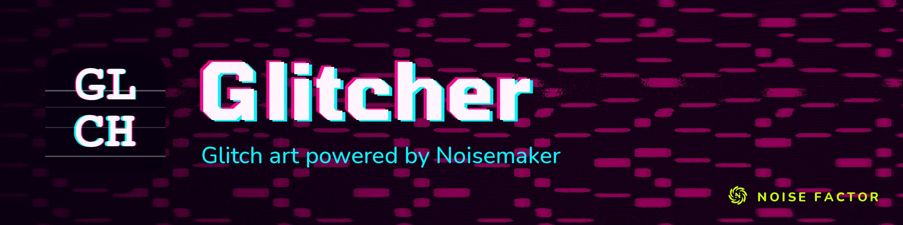

<!-- repo-hero -->
<a href="https://glitcher.noisefactor.io/"></a>

<sub>Open source from <a href="https://noisefactor.io">Noise Factor</a> &middot; <a href="https://github.com/noisefactorllc">more projects</a></sub>

# glitchin' out

Glitch-art tool powered by the [Noisemaker](https://noisemaker.app/) shader engine.

Build a stack of glitch effects — datamosh, pixel sort, scanline error, lens warp, snow, chromatic aberration, feedback — over a live camera or an uploaded image. Each slot has its own intensity slider and a dice button that re-rolls just that effect. GLITCHIFY rebuilds the whole stack at random.

## Features

- **Effect stack** — chain any number of glitch effects in any order
- **Per-effect intensity** — slider lerps between defaults and a randomized snapshot
- **Per-effect re-roll** — dice button rerolls just that slot
- **GLITCHIFY** — build a random 2-4 effect stack instantly
- **Starter chains** — one-tap multi-effect starting points (Datamosh, Dead Tape, CRT, Slice, …)
- Live camera (front/rear switch) or image upload
- Photo (PNG) and video (WebM) capture
- Filmstrip gallery with IndexedDB persistence
- Mobile responsive, no install, no account, no tracking

## Getting Started

Requires [Node.js](https://nodejs.org/) 18+.

```bash
npm install
npm run dev
```

Open http://localhost:3007 in your browser. Grant camera access when prompted.

## Keyboard

| Key | Action |
|-----|--------|
| `g` | GLITCHIFY |
| `r` | Re-roll every slot |
| Space | Shutter |
| `m` | Mirror flip |

## Tech Stack

- Vanilla JavaScript (ES modules, no framework)
- [Noisemaker](https://noisemaker.app/) shader pipeline via CDN
- [Handfish](https://handfish.noisefactor.io/) design system
- Served with `http-server` — no build tools needed

## License

[MIT](LICENSE) — Copyright (c) 2026 Noise Factor LLC
